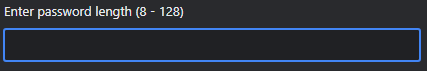

# Personal Password Generator v1.0

## Description

A password generator that provides all the necessary criteria you need. 
This will generate a password with the prompts you need: 
- lowercase letters
- uppercase letters
- numeric characters
- special characters

All within the length between 8 - 128 characters for your own satisfaction.

## Usage

To use the password generator, please follow the instructions below:

Click the red button labeled "Generate Password". 

Then input the amount of characters you want in your password.

Next, confirm or cancel the prompt if you want the password to have lowercase characters.

Confirm or cancel the prompt if you want the password to have uppercase characters.

Confirm or cancel the prompt if you want the password to have numbers.

Finally, confirm or cancel the prompt if you want the password to have special characters.

You should then be able to see your newly generated password in the text box.
Be sure to save your password in a secure space or use a password manager software!